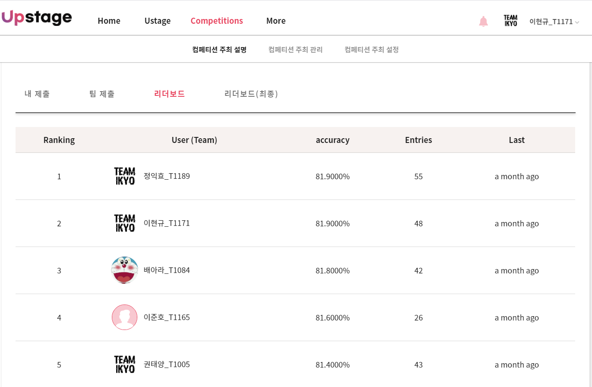
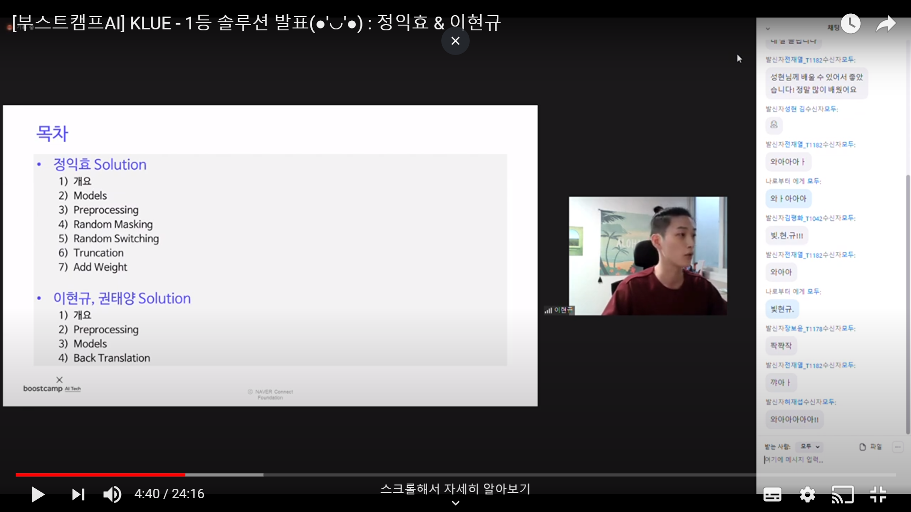
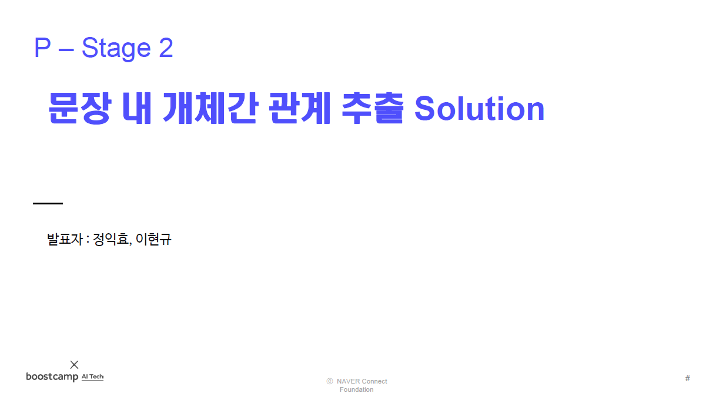
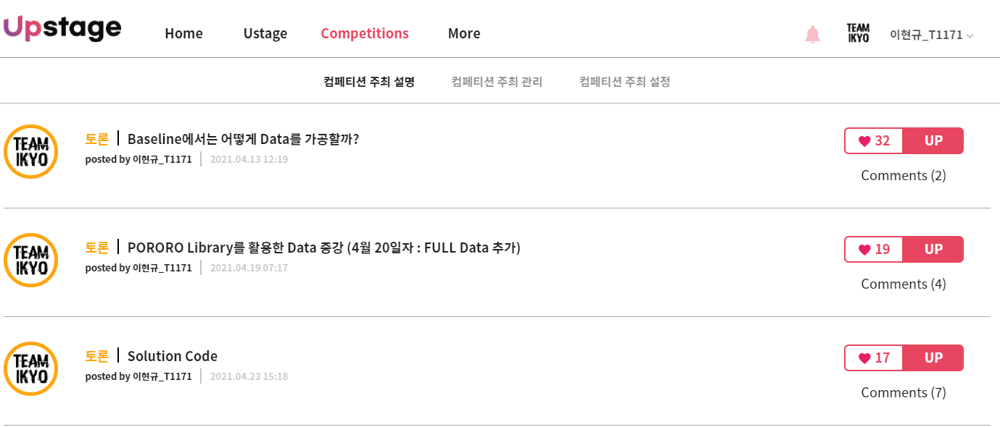

# 문장 내 개체간 관계 추출

### Tag
Boostcamp | PStage2

___

## 성과

### 최종 순위 1위(공동) 달성  
 ([link](http://boostcamp.stages.ai/competitions/4/leaderboard))  

### Solution 발표 영상
 ([link](https://youtu.be/oVjd4vBidog))  

### Solution 발표 자료
 ([link](https://github.com/bcaitech1/p2-klue-LeeHyeonKyu/tree/main/etc/KLUE_Solution.pdf))  

### 각종 토론 글 작성  
 ([link](http://boostcamp.stages.ai/competitions/4/discussion?sort=4&page=1))  

___

## 대회 개요

### 전체 개요 설명
관계 추출(Relation Extraction)은 문장의 단어(Entity)에 대한 속성과 관계를 예측하는 문제입니다. 관계 추출은 지식 그래프 구축을 위한 핵심 구성 요소로, 구조화된 검색, 감정 분석, 질문 답변하기, 요약과 같은 자연어처리 응용 프로그램에서 중요합니다. 비구조적인 자연어 문장에서 구조적인 triple을 추출해 정보를 요약하고, 중요한 성분을 핵심적으로 파악할 수 있습니다.
위 그림의 예시와 같이 요약된 정보를 사용해 QA 시스템 구축과 활용이 가능하며, 이외에도 요약된 언어 정보를 바탕으로 효율적인 시스템 및 서비스 구성이 가능합니다.  
이번 대회에서는 문장, 엔티티, 관계에 대한 정보를 통해 ,문장과 엔티티 사이의 관계를 추론하는 모델을 학습시킵니다. 이를 통해 우리의 인공지능 모델이 엔티티들의 속성과 관계를 파악하며 개념을 학습할 수 있습니다. 우리의 model이 정말 언어를 잘 이해하고 있는 지, 평가해 보도록 합니다. 
([link](http://boostcamp.stages.ai/competitions/4/overview/description))  

### 평가 방법  
모델 제출은 하루 5회로 제한됩니다.  
평가는 테스트 데이터셋의 Accuracy 로 평가 합니다. 테스트 데이터셋으로 부터 관계를 예측한 classes를 csv 파일로 변환한 후, 정답과 비교합니다. 
([link](http://boostcamp.stages.ai/competitions/4/overview/description))  

___

## 대회 참여

### 참여 일정
|일시|내용|비고|  
|:--:|:--:|:--:|
|21.04.12 ~ 13| Baseline 이해 ||
| | | |

### 참여 내용 (상세)
Wrap-up Report에 자세히 작성했습니다. 
([link](https://github.com/bcaitech1/p2-klue-LeeHyeonKyu/blob/main/etc/wrap_up_report.pdf))  
